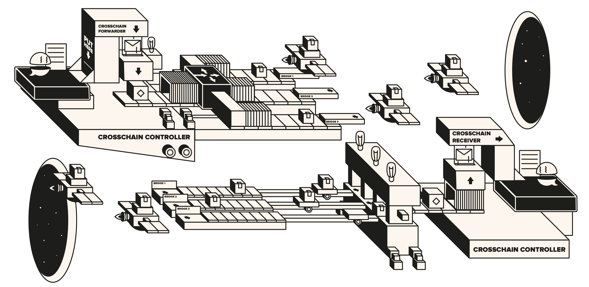

# a.DI (Aave Delivery Infrastructure)

 

a.DI (Aave Delivery Insfrastucture) is a cross-chain communication abstraction layer  for decentralised systems
like the Aave DAO to communicate across networks, minimising the risk of underlying individual bridge provider failures, via consensus rules.

 

## Specifications

Extensive documentation about the architecture and design of the system can be found [HERE](./docs/overview.md).

Additional, more formal (but natural language) properties of the system can be found [HERE](./docs/properties.md).

 

## Setup instructions

All the information about setup of the project and deployments can be found [HERE](./docs/setup.md)

 

## Deployed Addresses

| Network                                                                                                                                                                                        | CrossChainController                                                                                                             | Forwards to                                                                                                                                                                                                                                                                                                                                                                                                                                                                                                                                                                                                                                                                                                                                                                                                                              | Receives from | Consensus                                                                                                                                                                                                                                                                                                                                                                                          |
|------------------------------------------------------------------------------------------------------------------------------------------------------------------------------------------------|----------------------------------------------------------------------------------------------------------------------------------|------------------------------------------------------------------------------------------------------------------------------------------------------------------------------------------------------------------------------------------------------------------------------------------------------------------------------------------------------------------------------------------------------------------------------------------------------------------------------------------------------------------------------------------------------------------------------------------------------------------------------------------------------------------------------------------------------------------------------------------------------------------------------------------------------------------------------------------|---------------|----------------------------------------------------------------------------------------------------------------------------------------------------------------------------------------------------------------------------------------------------------------------------------------------------------------------------------------------------------------------------------------------------|
| 

Ethereum

 | [0xEd42a7D8559a463722Ca4beD50E0Cc05a386b0e1](https://etherscan.io/address/0xEd42a7D8559a463722Ca4beD50E0Cc05a386b0e1)            |             

   |    | 

2/3

 

3/4

 |
| 

Polygon

 | [0xF6B99959F0b5e79E1CC7062E12aF632CEb18eF0d](https://polygonscan.com/address/0xF6B99959F0b5e79E1CC7062E12aF632CEb18eF0d)         |                                                                                                                                                                                                                                                                                                                                                                                                                                                                                                                                                                                                                                                                                                                                       |         | 

3/4

                                                                                                                                                                                                   |
| 

Avalanche

 | [0x27FC7D54C893dA63C0AE6d57e1B2B13A70690928](https://snowtrace.io/address/0x27FC7D54C893dA63C0AE6d57e1B2B13A70690928)            |                                                                                                                                                                                                                                                                                                                                                                                                                                                                                                                                                                                                                                                                                                                                       |          | 

2/3

                                                                                                                                                                                                   |
| 

Arbitrum

 | [0xCbFB78a3Eeaa611b826E37c80E4126c8787D29f0](https://arbiscan.io/address/0xCbFB78a3Eeaa611b826E37c80E4126c8787D29f0)             | -                                                                                                                                                                                                                                                                                                                                                                                                                                                                                                                                                                                                                                                                                                                                                                                                                                        |        | 

1/1

                                                                                                                                                                                                   |
| 

Optimism

 | [0x48A9FE90bce5EEd790f3F4Ce192d1C0B351fd4Ca](https://optimistic.etherscan.io/address/0x48A9FE90bce5EEd790f3F4Ce192d1C0B351fd4Ca) | -                                                                                                                                                                                                                                                                                                                                                                                                                                                                                                                                                                                                                                                                                                                                                                                                                                        |         | 

1/1

                                                                                                                                                                                                   |
| 

Binance

 | [0x9d33ee6543C9b2C8c183b8fb58fB089266cffA19](https://bscscan.com/address/0x9d33ee6543C9b2C8c183b8fb58fB089266cffA19)             | -                                                                                                                                                                                                                                                                                                                                                                                                                                                                                                                                                                                                                                                                                                                                                                                                                                        |         | 

2/3

                                                                                                                                                                                                   |
| 

Base

      | [0x529467C76f234F2bD359d7ecF7c660A2846b04e2](https://basescan.org/address/0x529467C76f234F2bD359d7ecF7c660A2846b04e2)            | -                                                                                                                                                                                                                                                                                                                                                                                                                                                                                                                                                                                                                                                                                                                                                                                                                                        |         | 

1/1

                                                                                                                                                                                                   |
| 

Metis

   | [0x6fDaFb26915ABD6065a1E1501a37Ac438D877f70](https://explorer.metis.io/address/0x6fDaFb26915ABD6065a1E1501a37Ac438D877f70)       | -                                                                                                                                                                                                                                                                                                                                                                                                                                                                                                                                                                                                                                                                                                                                                                                                                                        |         | 

1/1

                                                                                                                                                                                                   |
| 

Gnosis

 | [0x8Dc5310fc9D3D7D1Bb3D1F686899c8F082316c9F](https://gnosisscan.io/address/0x8Dc5310fc9D3D7D1Bb3D1F686899c8F082316c9F)           | -                                                                                                                                                                                                                                                                                                                                                                                                                                                                                                                                                                                                                                                                                                                                                                                                                                        |         | 

2/3

                                                                                                                                                                                                   |
| 

Scroll

 | [0x03073D3F4769f6b6604d616238fD6c636C99AD0A](https://scrollscan.com/address/0x03073D3F4769f6b6604d616238fD6c636C99AD0A)       | -                  |         | 

1/1

                                                                                                                                                                                                   |
| 

ZkEVM

 | [0xed7e0874526B9BB9E36C7e9472ed7ed324CEeE3B](https://zkevm.polygonscan.com/address/0xed7e0874526B9BB9E36C7e9472ed7ed324CEeE3B)       | -                  |         | 

1/1

                                                                                                                                                                                                   |
| 

Celo

      | [0x4A5f4b29C0407E5Feb323305e121f563c7bC4d79](https://celoscan.io/address/0x4A5f4b29C0407E5Feb323305e121f563c7bC4d79)       | -                  |         | 

2/3

                                                                                                                                                                                                   |
| 

Linea

      | [0x4A5f4b29C0407E5Feb323305e121f563c7bC4d79](https://lineascan.build/address/0x4A5f4b29C0407E5Feb323305e121f563c7bC4d79)       | -                  |         | 

1/1

                                                                                                                                                                                                   |
| 

Sonic

      | [0x58e003a3C6f2Aeed6a2a6Bc77B504566523cb15c](https://sonicscan.org/address/0x58e003a3C6f2Aeed6a2a6Bc77B504566523cb15c)       | -                  |         | 

2/3

                                                                                                                                                                                                   |
| 

Soneium

      | [0x4A5f4b29C0407E5Feb323305e121f563c7bC4d79](https://soneium.blockscout.com/address/0x4A5f4b29C0407E5Feb323305e121f563c7bC4d79)       | -                  |         | 

1/1

                                                                                                                                                                                                   |
| 

ZkSync

      | [0x4A5f4b29C0407E5Feb323305e121f563c7bC4d79](https://era.zksync.network/address/0x4A5f4b29C0407E5Feb323305e121f563c7bC4d79)       | -                  |         | 

1/1

  
| 

Ink

      | [0x990B75fD1a2345D905a385dBC6e17BEe0Cb2f505](https://explorer.inkonchain.com/address/0x990B75fD1a2345D905a385dBC6e17BEe0Cb2f505)       | -                  |         | 

1/1

                                                                                                                                                                                                   |
| 

Plasma

      | [0x643441742f73e270e565619be6DE5f4D55E08cd6](https://plasmascan.to/address/0x643441742f73e270e565619be6DE5f4D55E08cd6)       | -                  |         | 

2/3

                                                                                                                                                                                                   |
| 

Bob

      | [0xf630C8A7bC033FD20fcc45d8B43bFe92dE73154F](https://plasmascan.to/address/0xf630C8A7bC033FD20fcc45d8B43bFe92dE73154F)       | -                  |         | 

1/1

                                                                                                                                                                                                   |

 

| Network                                                                                                                                                                                                  | EmergencyRegistry                                                                                                      | Emergency Oracle                                                                                                        |
|----------------------------------------------------------------------------------------------------------------------------------------------------------------------------------------------------------|------------------------------------------------------------------------------------------------------------------------|-------------------------------------------------------------------------------------------------------------------------|
| 

Ethereum

    | [0x73C6Fb358dDA8e84D50e98A98F7c0dF32e15C7e9](https://etherscan.io/address/0x73C6Fb358dDA8e84D50e98A98F7c0dF32e15C7e9)  | -                                                                                                                       |
| 

Polygon

      | -                                                                                                                      | [0xDAFA1989A504c48Ee20a582f2891eeB25E2fA23F](https://polygonscan.com/address/0xDAFA1989A504c48Ee20a582f2891eeB25E2fA23F) |
| 

Avalanche

 | -                                                                                                                      | [0x41185495Bc8297a65DC46f94001DC7233775EbEe](https://snowtrace.io/address/0x41185495Bc8297a65DC46f94001DC7233775EbEe)   |
| 

Arbitrum

    | -                                                                                                                      | -                                                                                                                       |
| 

Optimism

    | -                                                                                                                      | -                                                                                                                       |
| 

Binance

           | -                                                                                                                      | [0x9d33ee6543C9b2C8c183b8fb58fB089266cffA19](https://bscscan.com/address/0x9d33ee6543C9b2C8c183b8fb58fB089266cffA19)    |
| 

Base

                | -                                                                                                                      | -                                                                                                                       |
| 

Metis

             | -                                                                                                                      | -                                                                                                                       |
| 

Gnosis

          | -                                                                                                                      | [0xf937ffaea1363e4fa260760bdfa2aa8fc911f84d](https://gnosisscan.io/address/0xf937ffaea1363e4fa260760bdfa2aa8fc911f84d)                                                                                                                    |
| 

Scroll

          | -                                                                                                                      | -                                                                                                                       |
| 

ZkEVM

           | -                                                                                                                      | -                                                                                                                       |
| 

Celo

                | -                                                                                                                      | [0x91b21900E91CD302EBeD05E45D8f270ddAED944d](https://gnosisscan.io/address/0x91b21900E91CD302EBeD05E45D8f270ddAED944d)     
| 

Sonic

                | -                                                                                                                      | [0xECB564e91f620fBFb59d0C4A41d7f10aDb0D1934](https://sonicscan.org/address/0xECB564e91f620fBFb59d0C4A41d7f10aDb0D1934)
| 

Ink

                | -                                                                                                                      | -                                                                              |
| 

Plasma

                | -                                                                                                                      | [0xF61FE74Ec1cFbd9Ee8Bd27592D2EDEe0E2aA85Cf](https://plasmascan.to/address/0xF61FE74Ec1cFbd9Ee8Bd27592D2EDEe0E2aA85Cf)                                                                              |
| 

Bob

                | -                                                                                                                      | -                                                                              |

 

## Changelog
### V1
- Date: 29 Oct 2023
- Forum discussions and proposals:
  - [Recap](https://governance.aave.com/t/bgd-a-di-aave-delivery-infrastructure/13951)
  - Activation [Proposal](https://governance-v2.aave.com/governance/proposal/355/)
- Security:
  - Extensive testing and internal review by the BGD Labs team.
    - [Tests suite](./tests/).

  - We have engaged [Emanuele Ricci](https://twitter.com/stermi) as external security partner in middle stages of the project, with outstanding results. This procedure was focused on non-biased modelling of the system in terms of flows and any kind of security problem and/or state inconsistency, keeping a tight feedback loop with the development team.

  - Extensive properties checking (formal verification) procedure by [Certora](https://www.certora.com/), a security service provider of the Aave DAO.
    - [Report](./security/certora/Formal%20Verification%20Report%20of%20Aave%20Delivery%20Infrastructure.md).
    - [Properties](./security/certora/properties).

  - Security review by [SigmaPrime](https://sigmaprime.io/), another security service provider of the Aave DAO.
    - [Reports](./security/sp).
    - [Test suite](https://github.com/sigp/aave-public-tests/tree/main/aave-delivery-infrastructure/tests).
- Diff: Release branch created [here](https://github.com/bgd-labs/aave-delivery-infrastructure/tree/release-v1.0.0)

### Post V1 Maintenance Proposals
- Date: 22 Mar 2024
- Forum discussions and proposals:
  - [Update a.DI implementation and CCIP adapters](https://vote.onaave.com/proposal/?proposalId=56&ipfsHash=0xfd641d22acacbcc09b476a08bb21c127dfc6d53b511bc7dc022135387159e3fd)
  - [Native bridge adapters update](https://vote.onaave.com/proposal/?proposalId=70&ipfsHash=0xe49d4ab826f1db54eda94e9d5ff536cb80d09ea4f0d6d36829f2626c95cac5f1)
  - [LayerZero bridge adapter update to V2](https://vote.onaave.com/proposal/?proposalId=83&ipfsHash=0x309c9f0c885674230940e60b2a8e6fba9a226483d9117ba916ef72d4e3bd013f)
  - [Hyperlane bridge adapter update to V3](https://vote.onaave.com/proposal/?proposalId=92&ipfsHash=0xb1cc692a9f2bed0923862de7ff7e603805f38b1b9da844a9977db9dec966b93e)
- Security:
  - Proposals where reviewed internally and by Certora
- Diff:
  - Release branch created [here](https://github.com/bgd-labs/aave-delivery-infrastructure/tree/release-revision-2)
  - diff with V1 [here](https://github.com/bgd-labs/aave-delivery-infrastructure/compare/release-v1.0.0...release-revision-2)

### V1.1
- Date:
- Forum discussions and proposals:
  - The V1.1 update consists on adding a shuffling mechanism to CCC and the addition of a new Granular guardian contract. A more in debth explanation can be found [here](https://governance.aave.com/t/bgd-a-di-aave-delivery-infrastructure-v1-1/17838)
- Security:
  - Granular Guardian:
    - [Report](security/certora/reports/Granular-Guardian-Access-Control.pdf)
  - Shuffling:
    - [Report](./security/certora/reports/aDI-Shuffle.pdf)
    - [Properties](./security/certora/properties)
- Diff:
  - Release branch created [here]()
  - diff with V1 Maintenance [here]()

## License

Copyright © 2025, Aave DAO, represented by its governance smart contracts.

Created by [BGD Labs](https://bgdlabs.com/).

The default license of this repository is [BUSL1.1](./LICENSE), but all interfaces and the content of the [libs folder](./src/contracts/libs/) and [Polygon tunnel](./src/contracts/adapters/polygon/tunnel/) folders are open source, MIT-licensed.

**IMPORTANT**. The BUSL1.1 license of this repository allows for any usage of the software, if respecting the *Additional Use Grant* limitations, forbidding any use case damaging anyhow the Aave DAO's interests.
