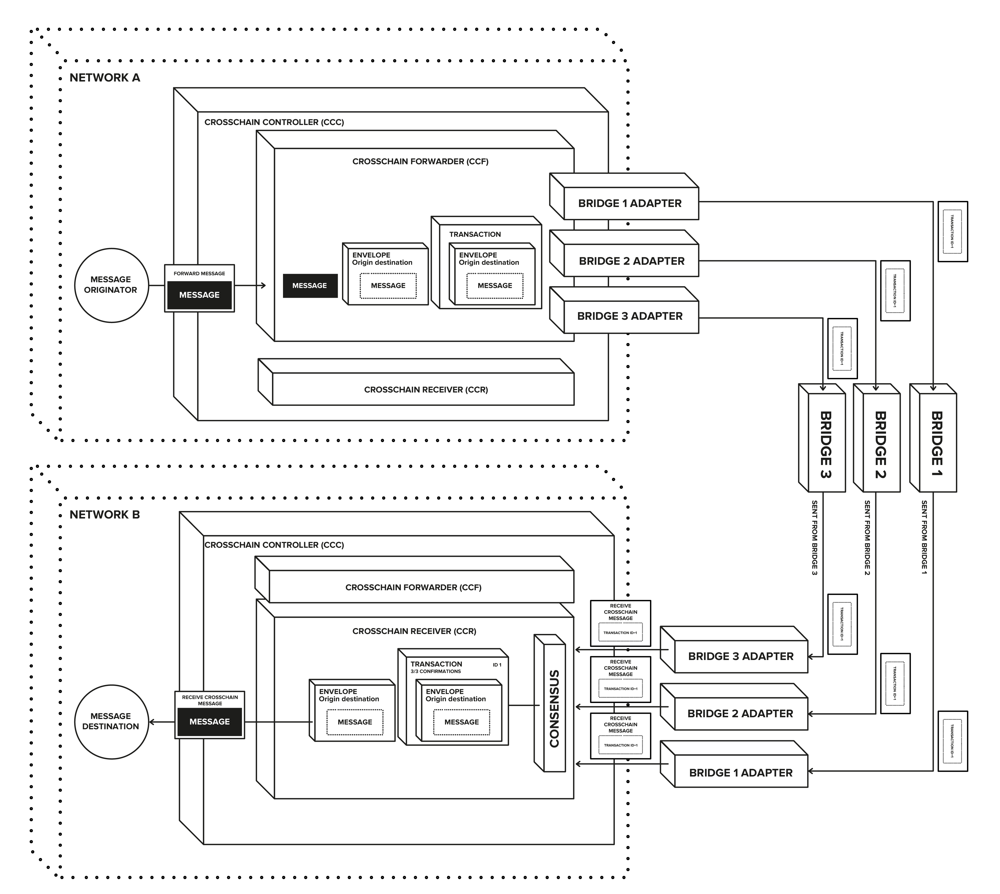
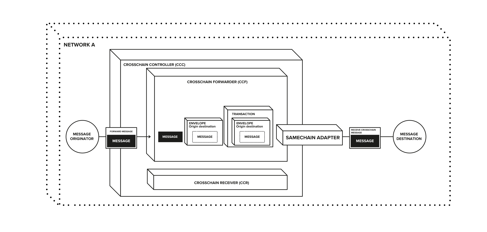
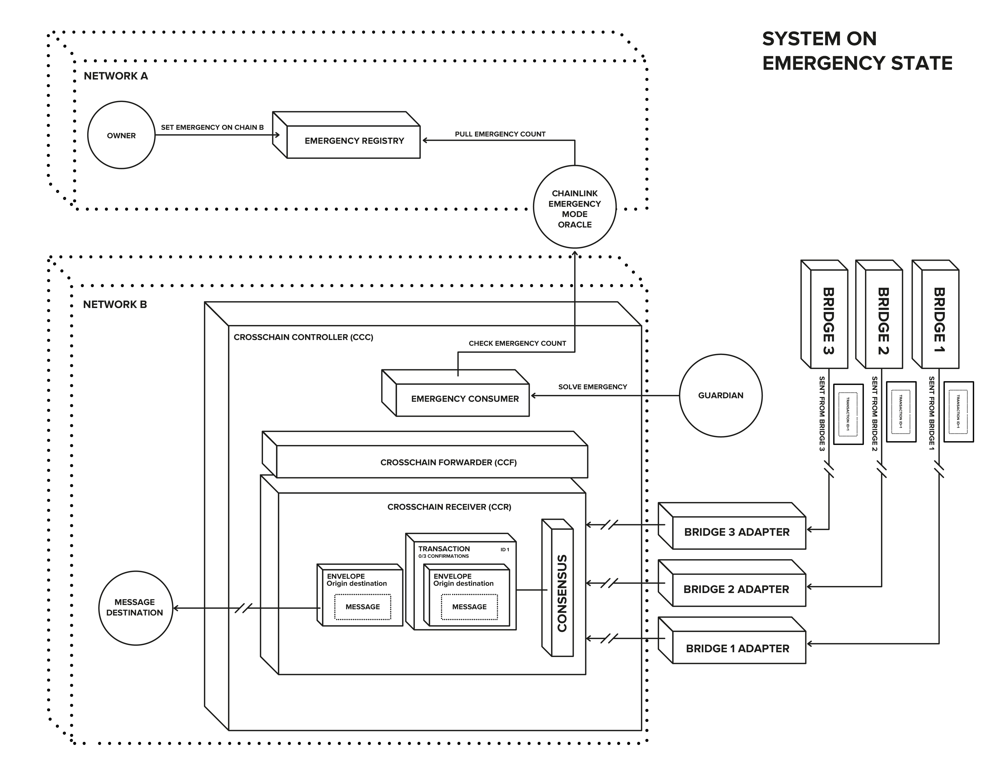
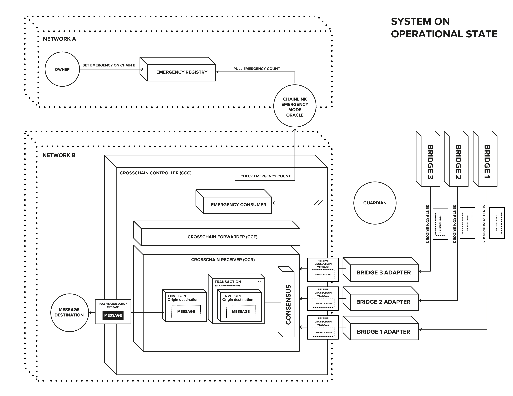

This document presents the a.DI (Aave Delivery Infrastructure) architecture/design, both at high and low level.

 

# Architecture

The design principles of a.DI are the following:
- **Bridge meta-consensus**. In a future (and present) of multiple message bridging providers, it becomes complicated for
decentralised entities like Aave to even evaluate the risk profile of each bridge. By defining an extra layer of consensus
on top, this risk gets significantly reduced, and aspects like the decentralisation nature of the underlying bridge become
less important.
- **Possibility of trusted recovery**. The (desired) generic and permissionless nature of DAO governance proposals require
having safety mechanisms to stop malicious ones. As bridging involves external entities, a.DI also implements levers for the DAO governance to activate an emergency mode and replace all current underlying bridges and rules in the system.
- **Well-defined UX**. Consequence of the meta-consensus implementation, a.DI acts as a "black-box" for its users: a
message is sent via a simple interface, and no knowledge of the underlying system is really required. Afterwards,
the message will just be received on the destination network always from the same contract.

 

## Contracts types

 

### Cross-chain Core contracts

These are the base contracts, internal to a.DI and defining all base mechanism of message sending/receiving, consensus and all safety mechanisms:

- [CrossChainForwarder (CCF)](../src/contracts/CrossChainForwarder.sol): contains the logic to send messages
  to other connected chains. To be able to send messages, the destination chain, with its receiver endpoint, must have been
  previously registered, and the caller must also be an approved sender. Apart from the approved senders, the Guardian will
  be able to retry sending previously sent messages. This can happen when there was insufficient gas, or the message failed
  to arrive to the destination for whatever reason.
  The amount of Bridge Adapters used to forward a message to its destination will be the minimum specified by the required confirmations
  of the receiver chain. The specified number of adapters will be selected (pseudo randomly) from the list of allowed forwarders.
  With this logic, a.DI can have any number of allowed forwarders for a specific destination chain, without increasing the cost
  of forwarding a message. Forwarder required confirmations set to 0, means that all allowed bridge adapters will be used to forward a message.
- [CrossChainReceiver (CCR)](../src/contracts/CrossChainReceiver.sol): contains the logic to receive messages
  from other chains. To route a message to the destination address, the message needs to be received correctly (from the
  different allowed bridges) a certain amount of times. To be received correctly means that it must be the exact same
  message received by the other bridges (n amount of bridges). For a destination to receive the message, it must implement
  this specific [interface](../src/contracts/interfaces/IBaseReceiverPortal.sol)
- [CrossChainController (CCC)](../src/contracts/BaseCrossChainController.sol): Contract that implements both `CrossChainForwarder` and `CrossChainReceiver`, to be the entry point to the a.DI.
This contract also holds the funds to pay for the usage of the different registered bridges.
  The CCC can be set up as an `Emergency Consumer`, allowing to activate the so-called Emergency Mode (more on this later).

 

### Cross-chain adapter contracts

Immutable utility contracts, which integrate into a.DI the specifics of each underlying bridge provider:

- [BaseAdapter](../src/contracts/adapters/BaseAdapter.sol): abstract contract that must be implemented by the bridge adapters.
  On the receiving side, it implements the method that will route the bridged message to the destination address. On the sender side, it implements the method to forward messages to the destination chain.
- **Individual bridge adapters**: all the different contracts that, by implementing the `BaseAdapter``, will communicate with the underlying bridge providers. The list of currently integrated bridge providers is:
  - [CCIP](../src/contracts/adapters/ccip/CCIPAdapter.sol)
  - [HyperLane](../src/contracts/adapters/hyperLane/HyperLaneAdapter.sol)
  - [LayerZero](../src/contracts/adapters/layerZero/LayerZeroAdapter.sol)
  - [SameChainAdapter](../src/contracts/adapters/sameChain/SameChainAdapter.sol): only implementing the method to
    send messages, by directly communicating with the receiving contract in the same chain where it is deployed. This pattern is useful to have same-chain-communication (bypass the cross chain bridging), but still following the same a.DI high-level flow.

Misc aspects of the bridge adapters:
- To send a message to the bridge provider, the method `forwardMessage()` is called, via `DELEGATECALL`. This way, the CCC can hold the funds to pay the bridges, and can also be used as a trusted receiver.
- **No storage variables should be used on the bridge adapters**.
- To receive a message a `handleReceive` (*the function name will actually depend on the
bridge being integrated*) method needs to be called via `CALL` . This call will compare the caller to the trusted remote configured on deployment.
- As mentioned before, the bridge are immutable contracts, so there are no permission-gated methods and no setters.

 

# Message Flow

The life cycle of a message from being sent to being received on the destination chain is as follows:
1. When a message arrives at the CCC via the CCF function `forwardMessage` it will be added to an envelope object. This unique `Envelope` has the necessary information for the message to be delivered on the destination chain. To be able to send the envelope to the destination chain, this is encoded into a unique `Transaction`, that is the payload sent to the authorized bridges.
    - To send the transaction to the bridge, the CCF will use the method `forwardMessage` on the bridge adapter contracts via delegatecall. This is done so the CCC can manage all the funds necessary for the usage of all the different bridges. This also makes it easier to maintain the correct trusted contracts from where the CCR can receive messages (It will always be the CCC).
2. On the destination chain, the adapter will receive a payload (which contains the encoded transaction) from the bridge
   it is attached to, and will pass it to the the CCR `receiveCrossChainMessage` along with the origin chain id, where the message originated.
     - For the BridgeAdapter to receive a message from the bridge, it will need to be a direct CALL, as usage of storage is
    needed (to check that the origin, caller, chainId are the ones allowed to call).
3. On the CCR the envelope will be extracted from the passed transaction, and a counter will be incremented to count towards
   the configured `requiredConfirmations` (this will only be affected if the transaction has not already been bridged from the given bridge). If the envelope reaches the required confirmations, then an attempt to deliver the message (contained in the envelope) to its destination will be triggered. If successful it will be marked as delivered, which prevents duplicated envelopes from being delivered.

There could be the case where the intention is to send a message to a destination on the same chain where the message
originates. In this case the life cycle would be the same as the cross chain flow, in the sense that it will encode the message into an `Envelope` and the envelope into a `Transaction`.
However, the adapter used will be the `SameChainAdapter`, which will unpack the Transaction and Envelope and send the message directly to the destination address, without doing any bridging.

The flow looks like this:

 

# System setup and actions

As the system is not opinionated on how it should be set up, there are different configurations that lead to different
use cases. However, this also means that a non-working state could be reached, so the following describes different methods
to update the a.DI configuration, and when and how to use them.

- CCF: contains configurations enable a.DI to send messages to other chains. If we only want to use a.DI for receiving messages, there is no need to configure it; it can be left empty.
  - `approveSenders` / `removeSenders`: the `owner` can specify who will be able to send messages to other chains.
  - `enableBridgeAdapters` / `disableBridgeAdapters`: the `owner` can set the bridge adapters that will be
    used for the specified chains. **Important**. If no bridge adapter is set for a chain, messages cannot be
    delivered to that chain.
      - There is also a special BridgeAdapter, called `SameChainAdapter`, that should only be used to add same chain communication.
      This adapter makes it so no bridges are used, and the message gets delivered directly to the destination. (A use case would be a fallback if communication with other chains breaks, and / or something needs to get executed on
    the same chain where the messages originated).
- CCR: contains methods enabling a.DI to receive messages from other chains, and deliver them to
  the destination address.. If the intention is to not receive messages (and only send), these configurations can be left empty.
  - `updateConfirmations`: the `owner` can set up the required confirmations by chain (consensus) to mark a received message as confirmed, and attempt a delivery. It needs to be at least one, meaning that it needs to receive at least the message from one bridge (a use case for only having one bridge would be when using a native bridge (roll-ups) as the security of the bridge if heavily tied to the network's). The recommendation though is to have the confirmations > 2 as this lowers dependence on individual bridges.
    - To have a working system `requiredConfirmations` needs to be reachable, meaning that the number of authorized bridge adapters should be more or equal than confirmations required. In the case that confirmations are not reachable, that chain will be effectively non-operative. The way to rescue the system would then be for the `owner` to lower confirmations or add more bridge adapters. If the `owner` is controlled by the origin chain
    (via cross-chain messaging), the way to rescue would be by triggering an emergency on the origin chain, which would enable the `guardian` role to solve the emergency by setting new configurations (*note that solving an emergency is not necessarily about rescuing the system. More about this at a later point*).
  - `allowReceiverBridgeAdapters` / `disallowReceiverBridgeAdapters`: allow the `owner` to add or remove bridge adapter
    by chain, effectively controlling from where messages will be received, from which underlying bridge providers. To be able to deliver a bridged message there needs to be at least enough bridge providers to be able to reach `requiredConfirmations`.
    Leaving this empty or lower than confirmations creates the same situation as with `requiredConfirmations`: this system becomes non-operative, and the `owner` (or emergency mechanism) needs to rescue it.
    - An use case to remove a bridge adapter for a chain could be if said bridge was exploited or had some kind of non-repairable problem. Then the `owner` could disable it for the specified chain, always being aware of potential side consequences, like loosing the capability to reach confirmations.

 

# Misc mechanisms

 

## Message Invalidation

This mechanism can be triggered by the `owner` in case a problem is detected on the allowed bridges. The method `updateMessagesValidityTimestamp` will set a new validity timestamp, which will effectively make it so that when a new transaction is received, if there were transactions with the same envelope that were received before the new validity timestamp, they will be ignored, making it impossible for an envelope to reach confirmations.

Then for an envelope to be processed again, after the problems get solved, it will need to be retried.

 

## Message Retries

Retries are enabled on both the CCF and the CCR:
- CCF: retries on forwarder are only available for the `owner` or `guardian` roles, to reduce the risk of draining funds from the CCC, used for payment of bridge providers.

  There are two 2 types of retry flows, depending on the requirements:
  - `retryEnvelope`: This method will take an existing envelope and will put it in a new transaction for bridging. It will
    use all the enabled bridges allowed for the destination chain id. In this case, when it arrives at the CCR, it will be
    treated as a new transaction (even if envelope was sent before) as transaction will have a new nonce (new transaction is unique).
    This can be useful for the case where an invalidation has happened, problems got fixed, so the envelope can be retried,
    which will start the count for confirmations from 0.
  - `retryTransaction`: This method will take an existing transaction and send it to a specified list of bridges. This case
    can be useful when the CCC did not have enough gas to send transaction to all bridges, or if a bridge had some internal problems but solved them. As it is not sending a new transaction, this will be accounted for the same `requiredConfirmations` counter on the CCR as the transaction initially sent (with same id with same envelope).

 

## Emergency Mode

The Emergency Mode is a mechanism of a.DI that enables an entity to signal other chains connected a.DI to enter into emergency mode.

Entering Emergency Mode means that the Guardian receives special permissions to update the CrossChainController (CCC) contract with new configurations. This enables the system to give limited permissions to a `guardian` role, while maintaining the possibility to fix the system if the cross chain communication and execution infrastructure breaks.

Once the Emergency is solved, the permissions granted to the `guardian` are removed.

 

**a.DI on Emergency Mode**

 

**a.DI on Operational Mode (non-emergency)**

 

### Contracts

- [EmergencyRegistry](../src/contracts/emergency/EmergencyRegistry.sol): contract containing the registry of the emergency
counts for every chain. The emergency count will be incremented by 1 when entering a new emergency on the specific chain.
To trigger an emergency on destination chain, the `owner` will need to call `setEmergency` with the chains where the emergency needs to be triggered.
- **Chainlink Emergency Mode Oracle**: This oracle (on all chains) will be updated by Chainlink whenever a new emergency
is triggered on the `EmergencyRegistry`` contract. This oracle will return the new emergency number.
- [EmergencyConsumer](../src/contracts/emergency/EmergencyConsumer.sol): contract storing the last emergency solved by
an inheriting contract. To check if the system can enter into emergency mode, a check is done between the local count
and the count provided by the Chainlink oracle. If local count is lower means that an emergency has been triggered, and
the `guardian` can call `solveEmergency`. When the call succeeds the local count is updated to the one provided by CL.

The `solveEmergency` goal is to return a.DI to the operational mode, which granularly, means the following:
- **Working Forwarding state**: this means that there is at least one BridgeAdapter configured for a specified chain, so a message can be sent to that chain.
- **Working Receiving state**: this means that there are enough bridge adapters configured so that when a message is received, `requiredConfirmations` can be reached.

The method can also be used as a way to force the system to a non-working state. This would be needed in the case that more than half of the bridges are compromised, so message should not be trusted (as the confirmations would then also be compromised), and `owner` could not be trusted since it is controlled via cross chain messaging.

In that case there would be two ways of solving the emergency:
1. When knowing exactly what to do (Remove bridge X, Invalidate message on a specific timestamp, etc), the `guardian`
  can call `solveEmergency` with the required parameters.
2. If the solution is more complex, and requires time to get right, the `guardian` can call `solveEmergency` with the
  necessary parameters to set itself as the unique bridge adapter and `requiredConfirmations` to 1. This would then enable
  the `guardian` to prepare and validate the correct payload to pass to the CCR (as bridge adapter) to return to a operational/working state.
